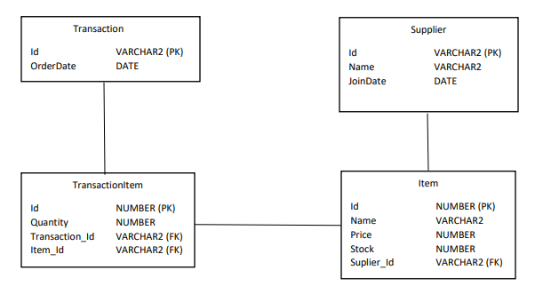

# Application-WPF

## WPF(Windows Presentation Foundation)
Merupakan next generation graphic platform yang memungkinkan anda membuat advance UI (User Interface) yang memadukan document, media, 2D dan 3D, dan animation yang memiliki kemiripan dengan pemrograman web.

### Fitur di Aplikasi
1. CRUD (Create Read Update Delete)
2. Login
3. Register
4. Change Password
5. Hash Password
